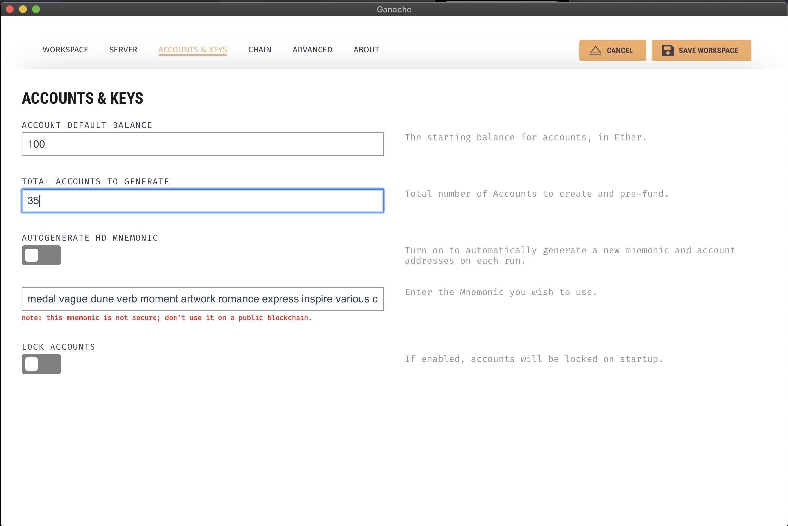

## Flight Surety - UND Blockchain Nanodegree Project

This project is about flight insurance. Passengers can buy flight insurance & if the flight is delayed they would get credited 1.5 times of the costing of insurance. This is ethereum blockchain based project. 

The project is divided into 2 smart contracts & 1 interface contract. It follows separation of concerns architectural pattern where Data contract or the persistance contract is different & business logic smart contract is different. This gives capability to smart contracts to upgrade or pause them in future.

Besides that this project also has classic *multi-party consensus* implementation for new flights registeration beyond a threshold number.

> NOTE : Given the initial starter code, this project has modified code base so that it functions well in 2021 with latest Truffle & Web3 Js configurations. Also it follows an updated Solidity Compiler 0.6.5


#### Project Setup

1. Download the code from this repository, extract the zip file & open terminal in root directory.
2. Run `npm install` to install all dependencies & dev dependencies.
3. Make sure your Truffle, Node, Solidity & Web3.Js **global** versions match as given below.
4. Run `truffle compile` to compile smart contracts
5. Run Ganache GUI tool, with 35 accounts configurations. (screenshot available below for ref.)
6. Run `truffle migrate` to deploy all contracts to Ganache powered ethereum blockchain
7. You can optionally run test cases now `truffle test ./test/flightSurety.js ` & `truffle test ./test/Oracles.js` 
8. To run server & register oracles, execute `npm run server`
9. To run dapp & test application, execute `npm run dapp`


#### Truffle, Solidity, Node & Web3 Version Info

```shell
Truffle v5.1.61 (core: 5.1.61)
Solidity - 0.6.5 (solc-js)
Node v14.12.0
Web3.js v1.2.9
```


#### Contract Compilation

```shell
$truffle compile

Compiling your contracts...
===========================
> Compiling ./contracts/DataInterfaceContract.sol
> Compiling ./contracts/FlightSuretyApp.sol
> Compiling ./contracts/FlightSuretyData.sol
> Compiling ./contracts/Migrations.sol
> Compiling ./node_modules/@openzeppelin/contracts/math/SafeMath.sol
> Artifacts written to /Users/..../flight-surety-oracle/build/contracts
> Compiled successfully using:
   - solc: 0.6.5+commit.f956cc89.Emscripten.clang
```

#### Ganache Setup with 35 Accounts




#### Contract Migration

```shell
Compiling your contracts...
===========================
> Everything is up to date, there is nothing to compile.


Starting migrations...
======================
> Network name:    'development'
> Network id:      5777
> Block gas limit: 6721975 (0x6691b7)


1_initial_migration.js
======================

   Deploying 'Migrations'
   ----------------------
   > transaction hash:    0xa65e251f7b64a42f71a433a78084bfdea40cbe6a92338c08fc5ba54836ffbd33
   > Blocks: 0            Seconds: 0
   > contract address:    0xD5166471b98330d0bF9F7FF26E9E233227d95512
   > block number:        224
   > block timestamp:     1615662611
   > account:             0xE075E0F7b980E6b9d797F7210B55bE509b6Ad32b
   > balance:             99.9801589746
   > gas used:            192159 (0x2ee9f)
   > gas price:           0.2 gwei
   > value sent:          0 ETH
   > total cost:          0.0000384318 ETH


   > Saving migration to chain.
   > Saving artifacts
   -------------------------------------
   > Total cost:        0.0000384318 ETH


2_deploy_contract.js
====================

   Deploying 'FlightSuretyData'
   ----------------------------
   > transaction hash:    0xb0596c81b34553776d7542e15f7f137c70c6a52d0255219293c00e55298d4c67
   > Blocks: 0            Seconds: 0
   > contract address:    0xE5afAc3cDb7eFE22d07D18dAa8A70171efD034be
   > block number:        226
   > block timestamp:     1615662611
   > account:             0xE075E0F7b980E6b9d797F7210B55bE509b6Ad32b
   > balance:             99.9797743814
   > gas used:            1880628 (0x1cb234)
   > gas price:           0.2 gwei
   > value sent:          0 ETH
   > total cost:          0.0003761256 ETH


   Deploying 'FlightSuretyApp'
   ---------------------------
   > transaction hash:    0x73b81021dfff2db1618dd5be95e603035e06ef6f8332d3cb9b7bc1df5daad636
   > Blocks: 0            Seconds: 0
   > contract address:    0x74fb8a7A191DA7733392a410dA21A1554B6832F3
   > block number:        227
   > block timestamp:     1615662611
   > account:             0xE075E0F7b980E6b9d797F7210B55bE509b6Ad32b
   > balance:             99.9791755944
   > gas used:            2993935 (0x2daf0f)
   > gas price:           0.2 gwei
   > value sent:          0 ETH
   > total cost:          0.000598787 ETH


   > Saving migration to chain.
   > Saving artifacts
   -------------------------------------
   > Total cost:        0.0009749126 ETH


Summary
=======
> Total deployments:   3
> Final cost:          0.0010133444 ETH
```

#### Deployed Contracts


#### Truffle Oracle Test Cases

```shell
truffle test ./test/Oracles.js 
Using network 'development'.


Compiling your contracts...
===========================
> Everything is up to date, there is nothing to compile.

  Contract: Oracles
Oracle Registered: 6, 5, 3
Oracle Registered: 4, 7, 0
Oracle Registered: 4, 2, 7
Oracle Registered: 6, 3, 9
Oracle Registered: 2, 7, 4
Oracle Registered: 1, 0, 8
Oracle Registered: 9, 8, 2
Oracle Registered: 6, 4, 0
Oracle Registered: 6, 9, 3
Oracle Registered: 6, 3, 1
Oracle Registered: 3, 4, 2
Oracle Registered: 4, 3, 9
Oracle Registered: 3, 7, 4
Oracle Registered: 4, 5, 2
Oracle Registered: 9, 2, 4
Oracle Registered: 3, 8, 6
Oracle Registered: 5, 9, 2
Oracle Registered: 4, 0, 1
Oracle Registered: 1, 6, 7
    ✓ can register oracles (9800ms)
    ✓ can request flight status (667ms)


  2 passing (11s)
```

#### Truffle Flight Surety Test Cases

```shell
truffle test ./test/flightSurety.js 
Using network 'development'.


Compiling your contracts...
===========================
> Everything is up to date, there is nothing to compile.


  Contract: Testcases For Flight Surety Project
    ✓ Check for initial Operational Values
    ✓ Access to changing operating status is blocked for non-contract owner account
    ✓ Access to changing operating status is allowed for contract owner account (93ms)
    ✓ Contract functions work only when requireIsOperational status is true (169ms)
    ✓ Funding is neccessary for airline to be registered/operational (161ms)
    ✓ Test for multi-party consensus in registering new airline  (553ms)
    ✓ Airline has to submit 10 ETH fund to become operational (280ms)
    ✓ Multi-party consensus initiates onlt after a threshold  (709ms)
    ✓ Passenger can buy inssurance for maximum of 1 ETH (173ms)
    ✓ Insured passenger can only be credited if flight is delayed (47ms)
    ✓ Credited passenger can withdraw insured amount only (86ms)


  11 passing (3s)
```


#### Initializing Server & Oracle Registration

```shell
npm run server

> flight-surety@1.0.0 server
> rm -rf ./build/server && webpack --config webpack.config.server.js

Hash: 0e6cde3fc11f74356b4e
Version: webpack 4.46.0
Time: 1378ms
Built at: 03/14/2021 12:42:59 AM
    Asset     Size  Chunks             Chunk Names
server.js  558 KiB       0  [emitted]  main
Entrypoint main = server.js
[0] multi webpack/hot/poll?1000 ./src/server/index 40 bytes {0} [built]
[./build/contracts/FlightSuretyApp.json] 1.33 MiB {0} [built]
[./node_modules/webpack/hot/log-apply-result.js] (webpack)/hot/log-apply-result.js 1.27 KiB {0} [built]
[./node_modules/webpack/hot/log.js] (webpack)/hot/log.js 1.34 KiB {0} [built]
[./node_modules/webpack/hot/poll.js?1000] (webpack)/hot/poll.js?1000 1.12 KiB {0} [built]
[./src/server/config.json] 180 bytes {0} [built]
[./src/server/index.js] 308 bytes {0} [built]
[./src/server/server.js] 4.99 KiB {0} [built]
[cors] external "cors" 42 bytes {0} [built]
[express] external "express" 42 bytes {0} [built]
[http] external "http" 42 bytes {0} [built]
[web3] external "web3" 42 bytes {0} [built]

Oracle Registered: 6, 3, 5 at 0x7162F6bF9995315f625557F635769d0AE3f35FfC
Oracle Registered: 9, 6, 2 at 0x1324f41855D48aC26CF073b03301A678192158D6
Oracle Registered: 0, 9, 3 at 0x20975C10b0E6216d7D57C05C4205b704E531fc87
Oracle Registered: 5, 6, 9 at 0x877B62b921FF581A2b79Da73FA6F16B66d5901C6
Oracle Registered: 3, 6, 1 at 0xD7848ED8C5d45338712BF1233EF7431e90937d41
Oracle Registered: 5, 6, 9 at 0xF6a485D5E94e1390e6efafab9761151289832207
Oracle Registered: 2, 6, 5 at 0xC0f316DE5D8140250782Fe34A58F7D43D80978E6
Oracle Registered: 6, 8, 9 at 0x2B25672dbB2dB7E9A06bd8CeBCaD2A69d6d75051
Oracle Registered: 5, 2, 7 at 0x1Fe7841f736FefA0dF81069e6708DcA844ba8B36
Oracle Registered: 3, 5, 2 at 0xB3Ae454559312308AFa62587D7976fa800d99964
Oracle Registered: 9, 0, 1 at 0x891D9dC930c996c686f845a805455185A4961004
Oracle Registered: 7, 8, 0 at 0xf6DB18dBad46b4231001af94Cda96cA57D7bdDfF
Oracle Registered: 8, 6, 7 at 0x256A810238A006904497b89Ab77901B2860392F3
Oracle Registered: 7, 1, 4 at 0xaE9d0fDA55024a5D92Dd2ceeC2190A24698f11c6
Oracle Registered: 1, 0, 3 at 0xC97957B14457aB6ad15E3bd441E5710e8FDEf80f
Oracle Registered: 1, 5, 9 at 0x5FA51bfF789De9fd6686Ab324de9805ba983d2f2
Oracle Registered: 1, 5, 9 at 0x5Db04fD9e93892dadB5326A4773AFfFb6C1fB0d1
Oracle Registered: 7, 3, 9 at 0x26dF8F10f37C01F095B25D70fe8bC03a79B9244C
Oracle Registered: 2, 7, 4 at 0xD8a1Fd39DC327B8cF4Cb331ba64CD2d180cCD44A
Oracle Registered: 5, 2, 6 at 0x1078376A0f79B78784Ce050f63df48175c83CD2c
Oracle Registered: 2, 1, 6 at 0xba6432F936909B807892f97350e6cd3BE622A215
Oracle Registered: 1, 7, 6 at 0x19532f1d3826e6390fFAb8C424eD2Af1FC47dF01
All oracles registered
```

#### Testing Server REST APIs


#### Initializing DApp

```shell
npm run dapp

> flight-surety@1.0.0 dapp
> webpack serve --mode development --env development --config webpack.config.dapp.js

ℹ ｢wds｣: Project is running at http://localhost:8000/
ℹ ｢wds｣: webpack output is served from /
ℹ ｢wds｣: Content not from webpack is served from /Users/xeuser/Desktop/blockchain_nanodegree/projects/flight-surety-oracle/dapp
ℹ ｢wdm｣:    823 modules
ℹ ｢wdm｣: Compiled successfully.
```


